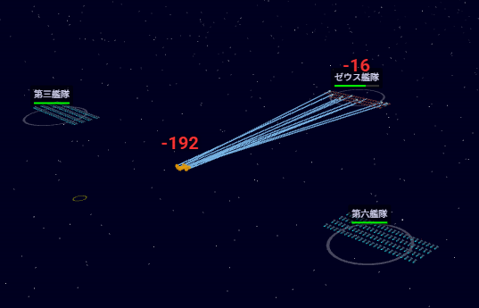

# SpacePeraPera

## 概要 (Overview)
「SpacePeraPera」は、Three.jsを使用して構築された、宇宙艦隊の指揮をテーマにしたリアルタイム戦術ゲームで、AntiGravityの能力を探求・実証することをテーマとしています。

## 特徴 (Features)

### リアルタイム艦隊制御 (Real-time Fleet Control)
Command multiple fleets (units) in real-time. Each unit consists of 100 ships that move and fight together.
複数の艦隊（ユニット）をリアルタイムで指揮します。各ユニットは100隻の艦船で構成され、共に移動し戦います。

### 陣形戦術 (Formation Tactics)
Switch between different formations to gain tactical advantages.
戦況に応じて陣形を切り替え、戦術的な優位性を得ることができます。

- **Spindle (スピンドル)**: Balanced formation. (バランス型)
- **Line (ライン)**: High attack, low defense. Good for broadsides. (攻撃重視、防御低。斉射向け)
- **Ring (リング)**: High defense, low movement. Good for holding position. (防御重視、移動低。拠点防衛向け)

### 方向別ダメージ (Directional Damage)
Damage varies based on the angle of attack. Flanking maneuvers are critical.
攻撃角度によってダメージが変化します。側面や背面からの攻撃（フランキング）が重要です。
- **Front (正面)**: 1.0x Damage
- **Side (側面)**: 1.25x Damage
- **Rear (背面)**: 1.5x Damage

### 3Dビジュアル (3D Visuals)
Detailed ship models, engine glows, and weapon effects rendered in 3D.
詳細な艦船モデル、エンジンの輝き、武器エフェクトなどが3Dで描画されます。

## スクリーンショット (Screenshots)



## 操作方法 (Controls)

| Action | Key / Mouse | 動作 |
|--------|-------------|------|
| **Select Unit** | Left Click | **ユニット選択** (左クリック) |
| **Move / Attack** | Right Click | **移動 / 攻撃** (右クリック) |
| **Pause / Resume** | Space | **一時停止 / 再開** (スペースキー) |
| **Change Speed** | PageUp / PageDown | **ゲーム速度変更** |
| **Zoom** | Mouse Wheel | **ズーム** (マウスホイール) |

## インストールと実行 (Installation & Usage)

1. Clone this repository.
   ```bash
   git clone https://github.com/yourusername/Ginei.git
   ```
2. Start a local server in the project directory.
   ```bash
   # Python 3
   python -m http.server
   # or Node.js
   npx http-server
   ```
3. Open `http://localhost:8000` (or the port shown) in your browser.
